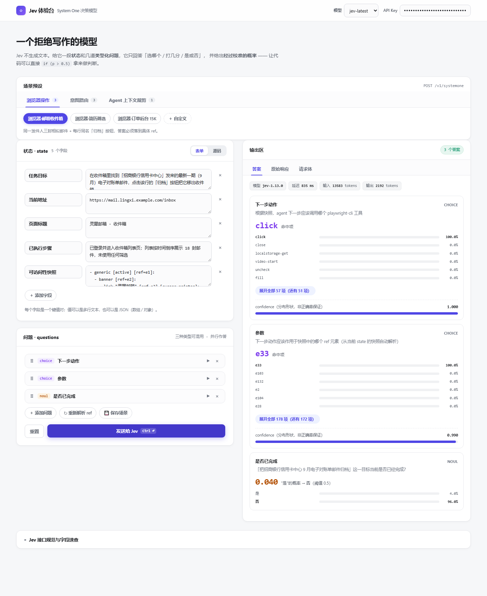
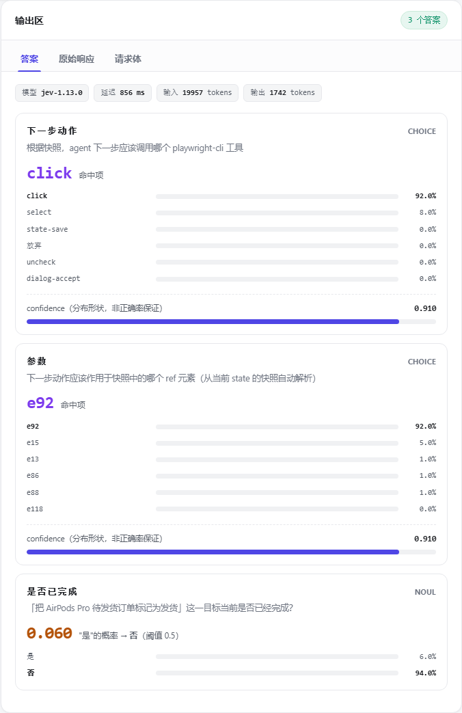

# Jev 体验台 · Jev Playground

零构建的本地网页 Demo（无打包、无框架；playwright-jev-agent 那部分需要 `playwright-core`，见下），用来体验 [TypeSafe](https://www.typesafe.ai) 的 **Jev（System One）决策模型**：发一段 state 和几道类型化问题（choice / score / noul），拿回选项、分值与校准概率。

A zero-build local web demo (no bundler, no framework; the playwright-jev-agent part needs `playwright-core`, see below) for TypeSafe's **Jev (System One)** decision model: send a state plus typed questions, get choices, scores and calibrated probabilities back.



## 内置场景

- **playwright-jev-agent**（Beta）—— 只给任务目标，工程自动构造 state 与问题，Jev 每轮决策并按需补问，playwright-cli 操作真实浏览器直到完成；每步的请求体、概率、执行与截图在前端全程可见。页面元素过多时，「参数」题候选按**并行召回**收敛（K 批并行问 Jev → 各批取概率前 N → 合并后再请 Jev 决策一次），算法与参数在「⚙ 配置 → 高级参数」里可切
- **浏览器操作（离线预设）** —— 把可访问性快照交给 Jev，选出下一步工具、目标 ref 与是否完成
- **意图识别** —— 工单分派 / 内容审核 / 意图路由，三种题型混用
- **Agent 上下文裁剪** —— 判断哪些工具调用与结果还值得留在上下文里



## 快速开始

```bash
npm install           # 只装 playwright-core（进程内驱动后端要用）
node server.js        # Node.js 18+；Windows 可直接双击 start.bat
```

打开 http://localhost:3000 ，在页面顶部填入 TypeSafe API Key 即可使用。内置四个演示页（📦 邮箱收件箱 / 📄 简历筛选 / 🧾 订单后台 / 🧾 订单后台（复杂））离线即可完整演示。两个订单页是刻意做出来的对照：简单版（15 笔 / 9 列 / 三行筛选）配套的 Auto 场景把步骤 ①→⑤ 写给模型；复杂版（18 笔 / 字段多一倍 / 五行筛选 + 高级筛选 + 卡片视图 + 行内展开，约 24K token）配套的场景只给一句业务意图，用来观察 Jev 能否自己把意图拆成步骤。

playwright-jev-agent 额外要求：

| 依赖 | 安装 | 说明 |
|---|---|---|
| Node.js 18+ | — | 启动时自动检查 |
| playwright-core | `npm install` | **≥ 1.59.0**，已写进 `package.json`。进程内后端用它直接驱动浏览器（启动时探能力，不达会提示并把后端退回 CLI） |
| playwright-cli | `npm i -g @playwright/cli` | 可选，仅「驱动后端 = playwright-cli」时需要（需 ≥ 0.1.17） |
| Chrome 或 Edge | 本机已装即可 | 在「⚙ 运行参数」里选，一个起不来会自动换另一个重试 |

### 驱动后端（决定「谁来下命令」，与内核/模式正交）

| 后端 | 机制 | 每步机械开销（实测，mailbox 8 步场景） |
|---|---|---|
| **进程内**（默认） | 自己持有 playwright-core 的 BrowserContext，每条命令是进程内函数调用 | `snapshot` 65ms · `page-info` 14ms · `act` 719ms |
| playwright-cli | 每条命令 `spawn` 一个新 node 进程（CLI 启动时约 0.8~1.0s 花在加载 playwright-core 上，且 CLI 没有常驻通道） | `snapshot` ~3900ms · `open` ~7800ms |

进程内起不来（playwright-core 缺失 / 版本不支持 AI 快照 / 启动失败）会**自动退回 CLI** 并在界面上说明原因，不会静默降级。想强制走 CLI：`JEVDEMO_BACKEND=cli`。

## 浏览器模式

「⚙ 运行参数 → 浏览器模式」三档，决定 run 期间驱动哪个浏览器实例：

| 模式 | 登录态 | 会碰你日常的浏览器吗 |
|---|---|---|
| **独立实例**（默认） | 每次重新登，profile 不落盘 | 不会 |
| **持久登录** | 首次在窗口里手动登一次，profile 落在 `data/browser-profile/` | 不会（独立进程，可与日常浏览器并存） |
| **CDP 直连** | 直接用你已开调试端口的那个浏览器 | **会**（见下） |

需要人工登录（扫码 / 验证码）时勾「开跑后先暂停」：点开始后任务停在**拍快照之前**，登录完点「▶ 已完成，继续」；暂停时长不计入「用时」。

**CDP 直连**：用平常的方式启动 Chrome（**不要**加 `--remote-debugging-port`）→ 打开 `chrome://inspect/#remote-debugging` 勾选允许 → 页面选「CDP 直连」、端点留空 → 弹框点允许（每次新连接都要点，**别反复重试**，重试会把弹框打掉）。端点只认 `ws://` 形态。运行期间只在它自己新建的专用标签页里操作，你已开的标签页不会被碰，窗口尺寸类命令一律拒绝。

## 配置与部署

API Key 填在网页里（存 localStorage，不落盘，推荐）或用环境变量 `TYPESAFE_API_KEY`（参考 `.env.example`）。

| 环境变量 | 说明 |
|---|---|
| `PORT` | 监听端口（默认 3000） |
| `TYPESAFE_API_KEY` | 服务端兜底 Key（可选，页面填的优先） |
| `ALLOW_ORIGIN` | CORS 允许来源（默认 `*`，生产建议改成你的域名） |

建议挂在反向代理（nginx / caddy）后做 HTTPS，并传 `X-Forwarded-For` —— 场景保存与浏览器会话按它的首段隔离租户（SHA-1 哈希后写入 `data/`，备份该目录即备份全部数据）。接口由 `server.js` 代理到 TypeSafe，规避浏览器 CORS 限制。

## 测试

```bash
npm test          # 单元 + 真实 playwright-cli 冒烟（引擎不可用自动跳过）
npm run test:e2e  # Auto 模式端到端（默认本地 oracle，可切真实 Jev）
```

## 项目结构

```
├── server.js          # 静态托管 + 接口代理（Jev / 生成模型）+ 场景保存 + 驱动接线
├── browser-driver.js  # 驱动门面：白名单 / 后端分发（进程内 ↔ playwright-cli）/ 超时 / 工件
├── browser-inproc.js  # 进程内后端：自持 playwright-core 的 BrowserContext（默认走这条）
├── tests/             # node:test 单元 + driver 冒烟 + E2E
└── public/            # index.html · styles.css · presets.js
    ├── demo/          # 四个内置演示页 + 共享企业外壳（enterprise.css / enterprise.js）
    │                  # mailbox · resume · orders（简单）· orders-complex（复杂）
    └── js/            # util · ref-context · ref-funnel · ref-recall · auto-core · auto · anno · state-editor · questions · output · app
```

## License

[MIT](./LICENSE)
